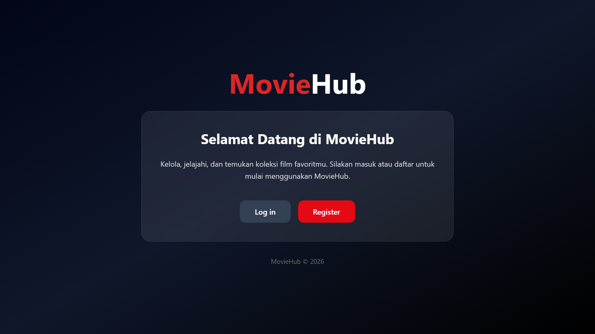
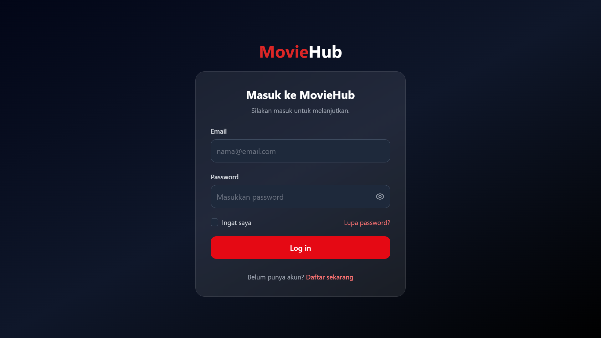
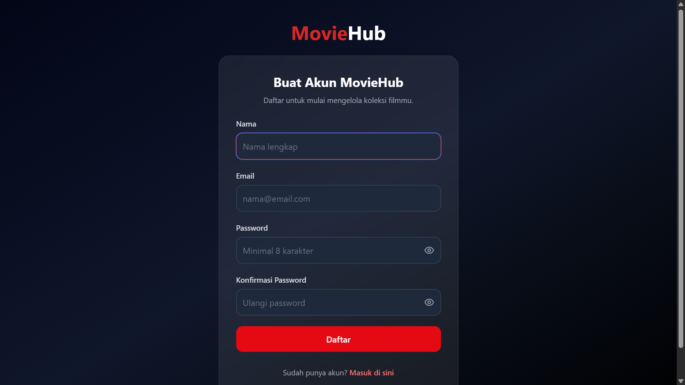
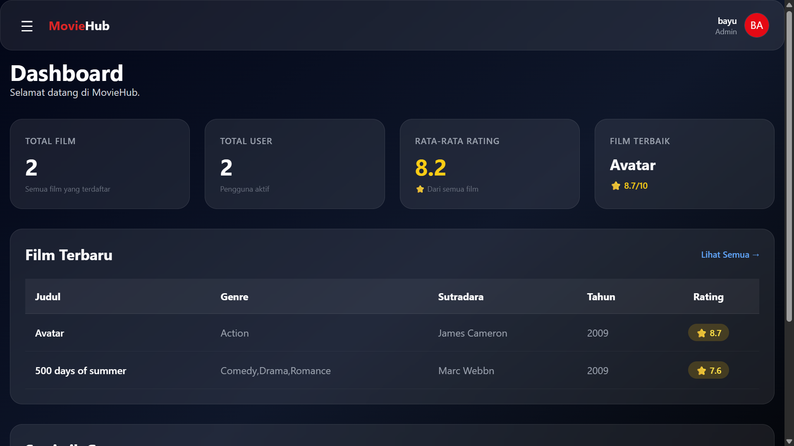
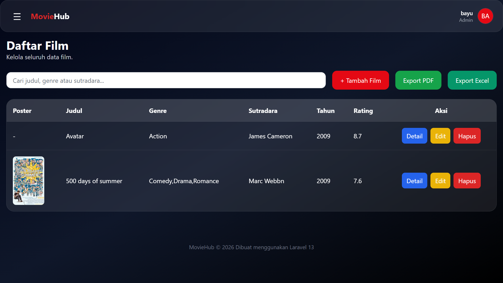
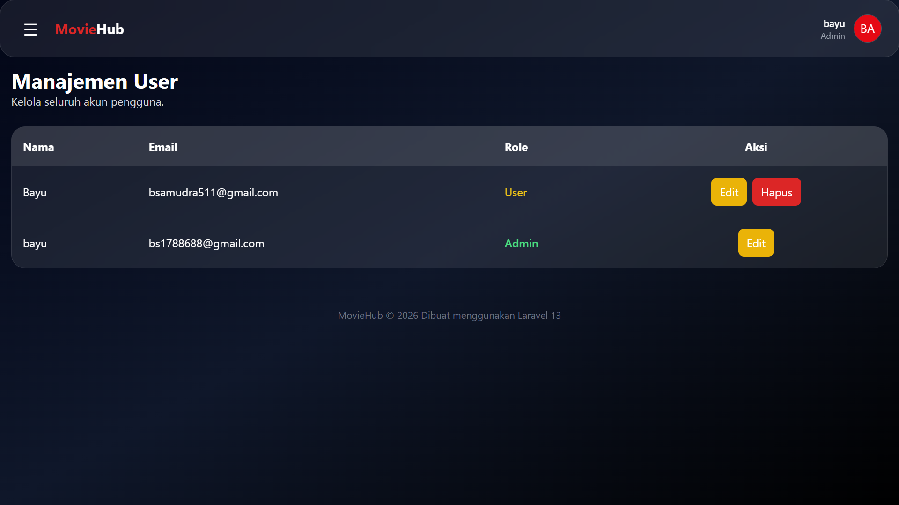
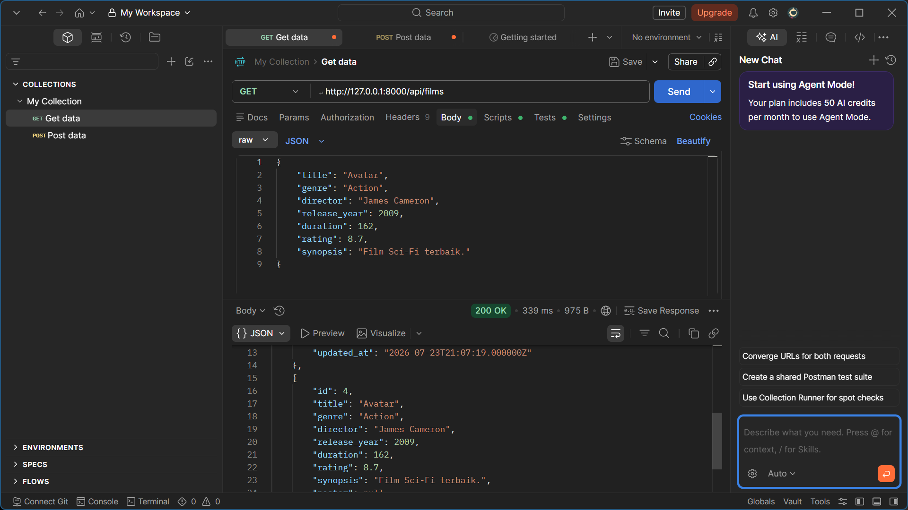

# 🎬 MovieHub

MovieHub adalah aplikasi berbasis web yang dikembangkan menggunakan **Laravel 13** untuk mengelola data film. Aplikasi ini memiliki sistem autentikasi, dashboard, manajemen film, manajemen pengguna berdasarkan role, upload poster, serta fitur export data ke PDF dan Excel.

---

# ✨ Fitur

- 🔐 Login & Register
- 📊 Dashboard
- 🎬 CRUD Data Film
- 🖼️ Upload Poster Film
- 👥 Role Admin & User
- 👤 Manajemen User (Admin)
- 📄 Export PDF
- 📊 Export Excel
- 🌐 REST API
- 🎨 UI Modern dengan Tailwind CSS

---

# 🛠️ Teknologi

- Laravel 13
- PHP 8.x
- MySQL
- Laravel Breeze
- Blade
- Tailwind CSS
- DomPDF
- Laravel Excel
- JavaScript

---

# 👤 Hak Akses

## Admin

- Login
- Dashboard
- CRUD Film
- Upload Poster
- Kelola User
- Export PDF
- Export Excel
- REST API

## User

- Login
- Dashboard
- Melihat Daftar Film
- Detail Film
- Export PDF
- Export Excel
- REST API

---

# 🚀 Instalasi

Clone repository

```bash
git clone https://github.com/USERNAME/moviehub.git
```

Masuk ke folder project

```bash
cd moviehub
```

Install dependency

```bash
composer install
```

Install package frontend

```bash
npm install
```

Copy file environment

```bash
cp .env.example .env
```

Generate application key

```bash
php artisan key:generate
```

Atur konfigurasi database pada file `.env`

Jalankan migrasi

```bash
php artisan migrate
```

Buat storage link

```bash
php artisan storage:link
```

Jalankan aplikasi

```bash
php artisan serve
```

Compile asset

```bash
npm run dev
```

---

# 📡 REST API

| Method | Endpoint | Deskripsi |
|---------|----------|-----------|
| GET | /api/films | Menampilkan seluruh data film |
| GET | /api/films/{id} | Menampilkan detail film |
| POST | /api/films | Menambahkan data film |
| PUT | /api/films/{id} | Mengubah data film |
| DELETE | /api/films/{id} | Menghapus data film |

---

# 📷 Screenshot

## Landing Page



---

## Login



---

## Register



---

## Dashboard



---

## Data Film



---

## User Management



---

## REST API (Postman)



---

# 📁 Struktur Folder

```
app/
bootstrap/
config/
database/
public/
resources/
routes/
storage/
```

---

# 👨‍💻 Developer

**Nama :** Bayu Samudera

**Program Studi :** Informatika

**Framework :** Laravel 13

---

# 📄 Lisensi

Project ini dibuat sebagai tugas mata kuliah **Pemrograman Web Framework** menggunakan Laravel 13.
